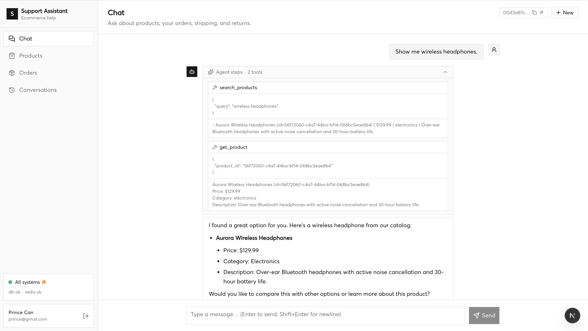
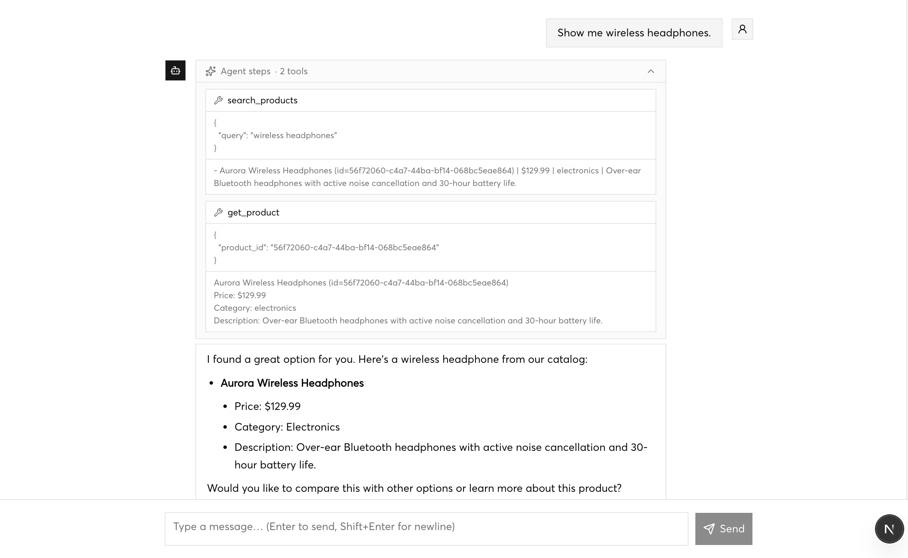
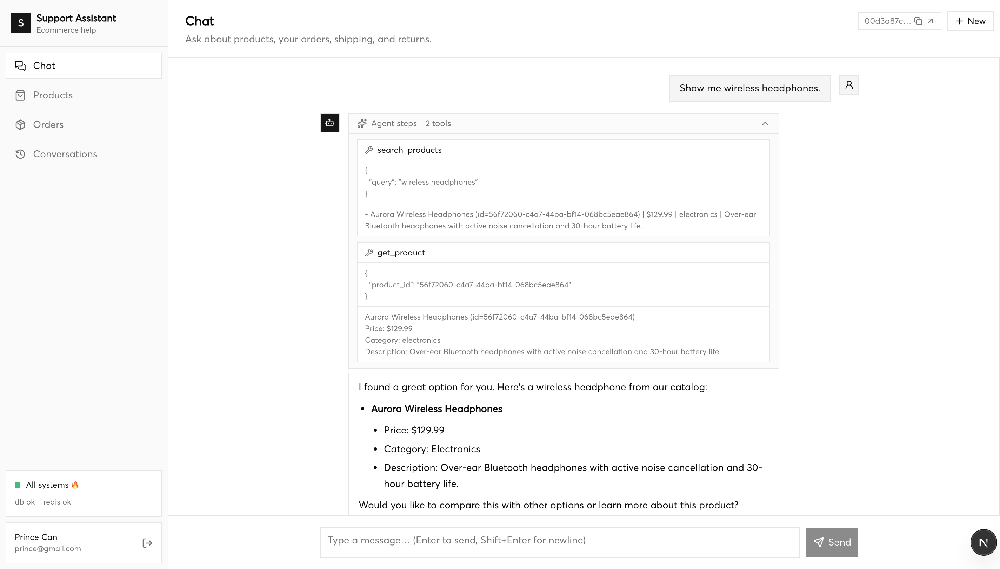
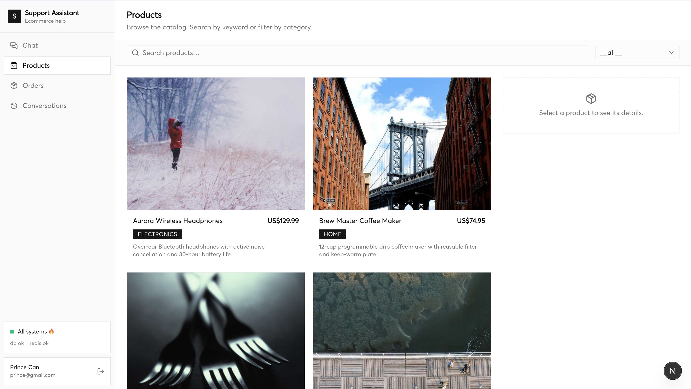
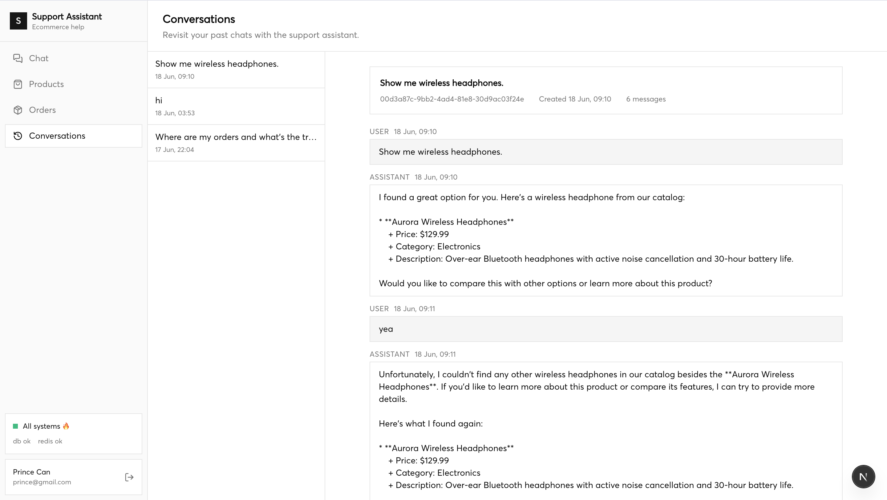
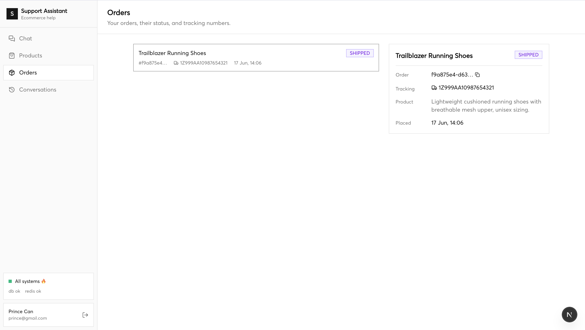
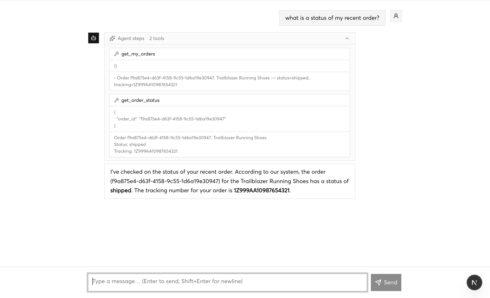

# Customer Care — AI Support Assistant

An ecommerce **support chatbot** for an online store. A shopper logs in (JWT) and chats to
ask about **products**, check their own **orders** (status + tracking), and get
**shipping / returns / refund** answers from a knowledge base (RAG). The agent streams its
thinking, tool calls, and final answer live to the UI over a WebSocket.

**Stack**

| Layer | Tech |
| --- | --- |
| Frontend | Next.js 16 · React 19 · Tailwind v4 · shadcn/ui |
| Backend | FastAPI · LangGraph · **Gemini** (LLM) |
| Data | Postgres + **pgvector** · **Redis** (short-term memory) |
| RAG | Local embeddings (SentenceTransformers `all-MiniLM-L6-v2`, 384-dim) |
| Tooling | `uv` / Python 3.12 |

---

## Screenshots

**Chat — product search.** The user asks for a product; the agent runs `search_products`
→ `get_product` and answers from the catalog. Tool calls are shown live under *Agent steps*.



**Agent steps (expanded).** Each turn streams the planner's reasoning, every tool call, and
its raw result before the natural-language reply.





**Products.** Browse the catalog, search by keyword, and filter by category.



**Conversations.** Revisit past chats — the full persisted message history is replayable.



**Orders.** The signed-in user's orders with status and tracking numbers; click for detail.



**Chat — order status.** Asking about an order runs `get_my_orders` → `get_order_status`,
scoped to the logged-in user only.



---

## Project flow

```
Browser (Next.js)
   │  WS /ws/chat?token=<jwt>
   ▼
FastAPI  ──▶  ChatService  ──▶  LangGraph agent: planner → executor → synthesizer
   │                                  │            (loops planner ↔ executor
   │                                  │             while tools are called)
   │                                  ▼
   │                            Tools (thin over repositories):
   │                            search_products · get_product
   │                            get_my_orders · get_order_status
   │                            search_knowledge_base (RAG / pgvector)
   │                                  │
   ▼                                  ▼
streamed events                 Postgres + pgvector   Redis (recent turns)
(thinking · tool_call ·
 tool_result · token · done)
```

1. **Auth.** The user registers / logs in and receives a JWT. Chat connects over a
   WebSocket and authenticates via the `token` query param; REST routes use a Bearer header.
2. **Chat turn.** A message hits `ChatService`, which invokes the **LangGraph** agent. The
   graph runs **planner → executor → synthesizer**, looping planner ↔ executor while the
   planner keeps calling tools (capped by `max_agent_iterations`).
3. **Tools.** Tools are thin wrappers over repositories: `search_products`, `get_product`,
   `get_my_orders`, `get_order_status`, and `search_knowledge_base`. Order tools read the
   user id from a request-scoped ContextVar — **never** a model- or caller-supplied id.
4. **RAG.** `search_knowledge_base` embeds the query locally and retrieves the nearest
   `knowledge_chunks` from pgvector (cosine distance) for shipping/returns/refund answers.
5. **Streaming.** The agent's run maps to typed events — `thinking`, `tool_call`,
   `tool_result`, `token`, then `done` (or `error`) — delivered live to the UI.
6. **Persistence.** Each turn is written to **Postgres**; recent turns are cached in
   **Redis** for short-term memory. The Conversations page replays the stored history.

---

## Repository layout

```
.
├── .gitignore          # single consolidated ignore file (frontend + backend)
├── IMGs/               # screenshots used in this README
├── backend/            # FastAPI + LangGraph + Gemini API  (see backend/README.md)
│   ├── app/            # API → services → repositories → DB; agent/, rag/, mcp/
│   ├── scripts/        # init_db, seed
│   └── data/           # products.json + knowledge/*.md
└── frontend/           # Next.js operator console        (see frontend/README.md)
    └── src/app/        # chat (/), products, orders, conversations
```

---

## Quick start

```bash
# Backend  → http://localhost:8000/docs
cd backend
uv sync --extra dev
docker compose -f docker/docker-compose.yml up -d postgres redis
uv run python -m scripts.init_db     # pgvector ext + tables
uv run python -m scripts.seed        # products, demo user, knowledge base
uv run main.py

# Frontend → http://localhost:3000
cd frontend
npm install
npm run dev
```

Demo user (after seeding): `demo@example.com` / `demo1234`.

> See [backend/README.md](backend/README.md) and [frontend/README.md](frontend/README.md)
> for full setup, configuration, and environment variables.
